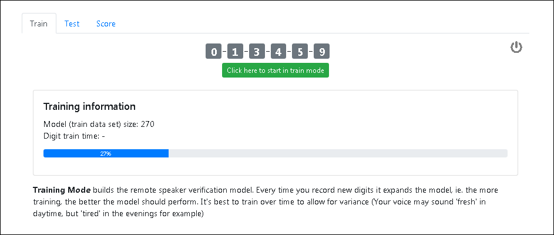

# Speaker Verification API demo
This is a demonstration of speaker verification (aka speaker authentication) using a REST API.

## Summary:
Normally speaker verification (authentication) systems are centralised. This means audio is recorded, then sent to the centralised system for processing. That's inefficent for remote or Web applications. This demonstrates an alternative distributed approach. Speech 'features' are extracted in the browser, then sent via REST API for authentication. 

## How it works:
Your browser will use the microphone to capture spoken digits, then process these to feature vectors ([MFCC's - mel frequency cepstral coefficients](https://en.wikipedia.org/wiki/Mel-frequency_cepstrum)). The feature vectors are sent to a remote API for speaker verification. The browser uses [Web Audio API ](https://developer.mozilla.org/en-US/docs/Web/API/Web_Audio_API) and [Meyda JS library](https://meyda.js.org/guides/online-web-audio) to capture the spoken data. The remote API uses a GMM ([Gaussian Mixture Model](https://en.wikipedia.org/wiki/Mixture_model)) machine learning method for speaker verification.


## Screenshots
Training the model:


## Demonstration 
See [Live demo on Heroku](https://speaker-verification-api-demo.herokuapp.com/) (running on a free dyno, might be a slow to start)


## Installation:
Install python from <https://www.python.org/>

### Clone 

```
git clone https://github.com/footfish/speaker-verification-api-demo.git
cd speaker-verification-api-demo
```

### Install required libs 
`pip install -r requirements.txt`

### Quick start 
`python api.py`

## Heroku Deployment:
The application can quickly be deployed to [Heroku](https://www.heroku.com/). 
You will need a Heroku account and the [Heruku cli](https://devcenter.heroku.com/articles/heroku-cli) installed. 

```
heroku create
git push heroku master
heroku open
```

## Command Line:
### curl REST testing from the cli 

**Train:** Train the model 

`curl -XPUT --header "Content-Type: application/json" --data @mfcc_train.json http://127.0.0.1:5000/train`

**Test:** Test the model with a simi
`curl -XPUT --header "Content-Type: application/json" --data @mfcc_test.json http://127.0.0.1:5000/test`

**Score:**
`curl -XPUT --header "Content-Type: application/json" --data @mfcc_train.json http://127.0.0.1:5000/score`


### Background 
You will find a good step-by-step example of Python speech processing code [here](https://github.com/footfish/python-speechprocessing-example) 

### References 
* [Flask restfull Quickstart](https://flask-restful.readthedocs.io/en/latest/quickstart.html)
* [Deploying a Machine Learning Model as a REST API](https://towardsdatascience.com/deploying-a-machine-learning-model-as-a-rest-api-4a03b865c166)
* [sklearn.mixture.GaussianMixture](https://scikit-learn.org/stable/modules/generated/sklearn.mixture.GaussianMixture.html)
* [Deploying Flask](https://flask.palletsprojects.com/en/1.0.x/deploying/)


g